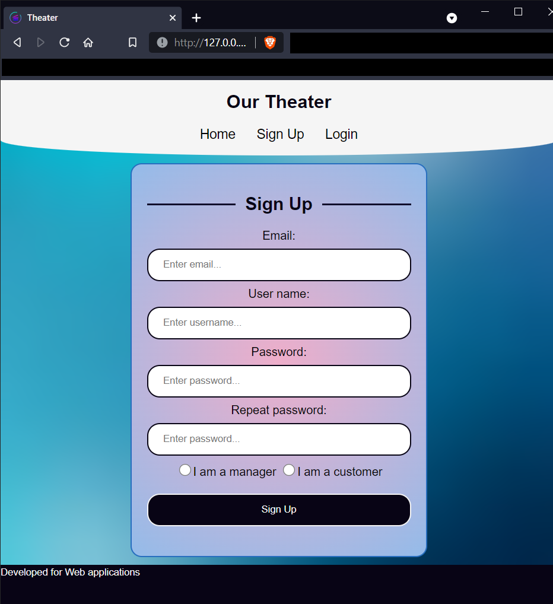
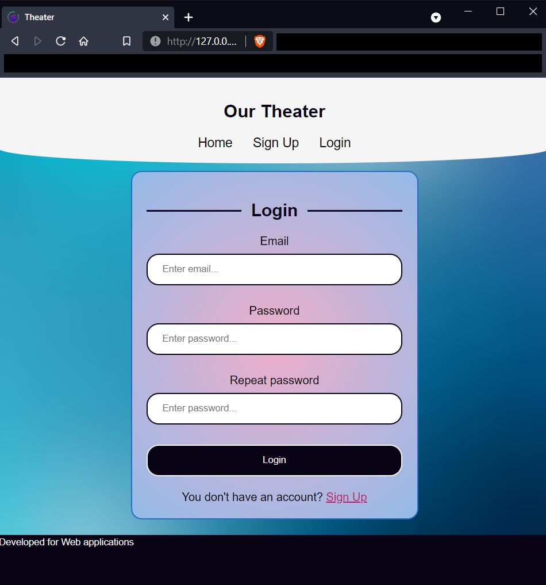
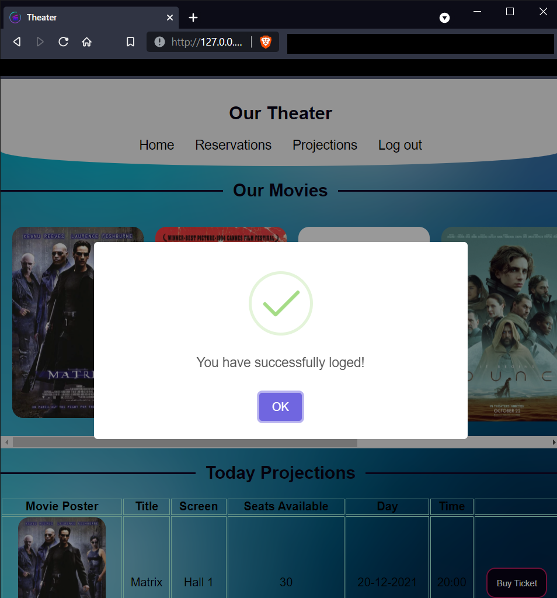
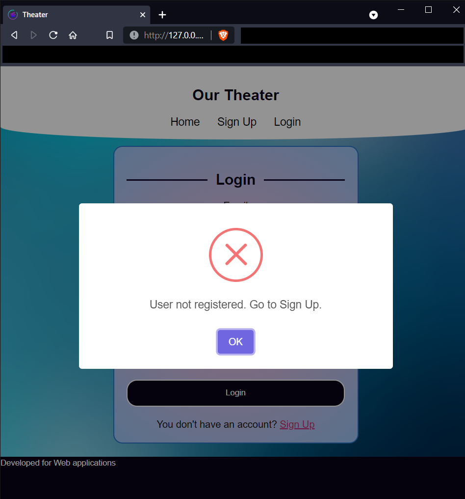
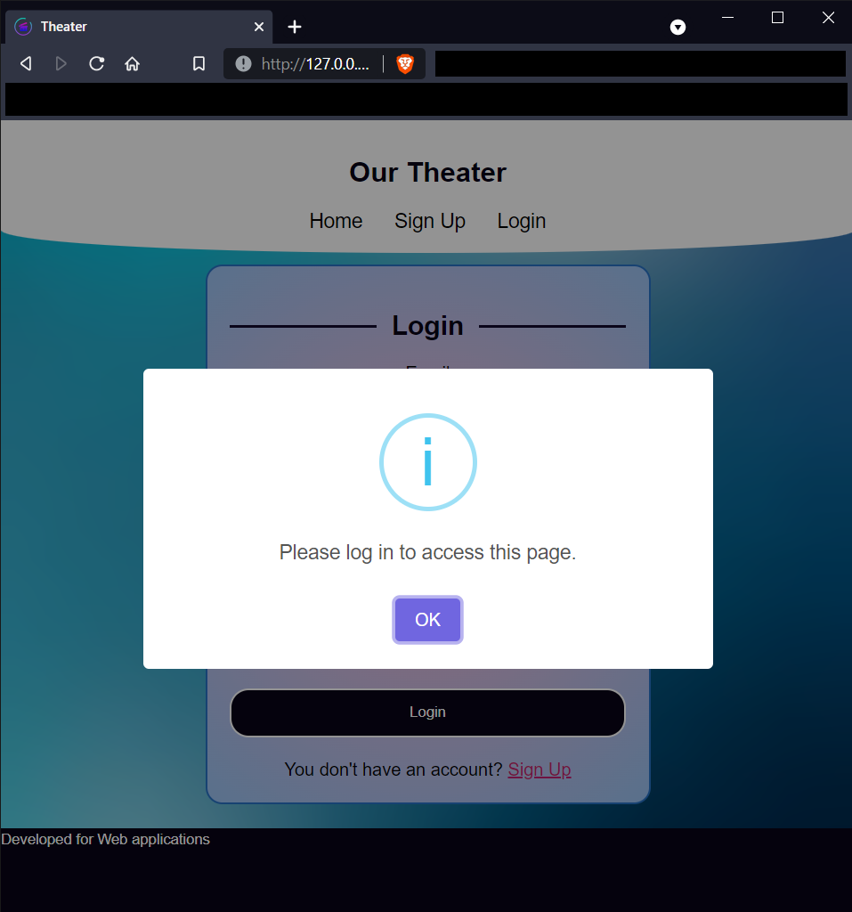
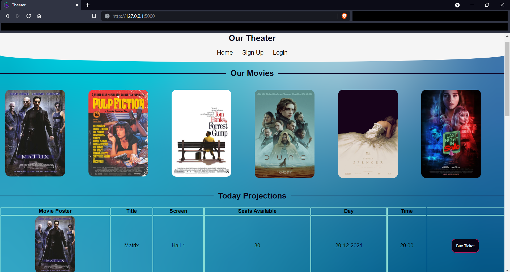

<h1 align="center">
   
  Theater Web App with Flask
</h1>

## Table of Contents
- [Project Description](#project-description)
- [Theater App Screenshots](#theater-app-screenshots)

## Project Description
This project is developed as part of the Evaluation of the Web Applications Course at UC3M. 

You can find the Course Web Site: https://www.it.uc3m.es/jaf/wa/

Project Statement: 
- https://www.it.uc3m.es/jaf/wa/labs/project/
- <a href="ProjectStatement.html">Project Statement</a>

## Theater App Screenshots

<table>
  <tr>
    <th>Sign Up</th>
    <th>Login</th>
  </tr>
  <tr>
    <td></td>
    <td></td>
  </tr>
 </table>

<table>
  <tr>
    <th>Success</th>
    <th>Error</th>
    <th>Info</th>
  </tr>
  <tr>
    <td></td>
    <td></td>
    <td></td>
  </tr>
 </table>

<table>
  <tr>
    <th>Home</th>
  </tr>
  <tr>
    <td></td>
  </tr>
 </table>